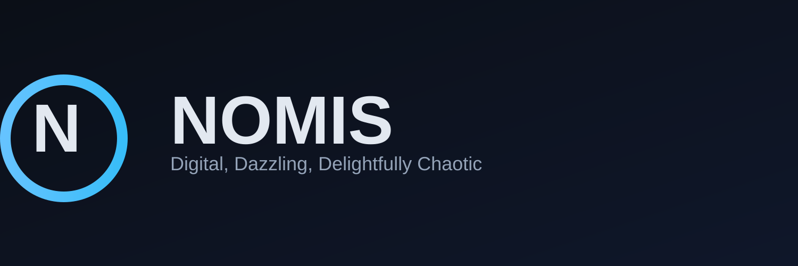

# NOOOMIS — React Simon memory game (Web + Android + Windows)



NOOOMIS is a modern take on the classic Simon memory game. The primary client is a React + TypeScript app (Vite) with polished UX, keyboard/touch support, and configurable audio. It ships with build tooling for Android (Cordova) and Windows (Electron), and includes legacy prototypes and Unity scripts for experimentation.

Looking for what changed recently? See CHANGELOG.md.

Nightly 2025-10-18:
- React client shows a lightweight splash overlay on start.
- Settings page simplified (no Audio Pack selection, no Logs Viewer).
- Dev server pinned to http://localhost:5173 (strictPort=true); Tauri devPath aligns.
- Windows CI pins tauri-cli to v1.6.0.

## Highlights

- React app with pages for Welcome, Tutorial, Classic, Challenges, and Settings
- Challenge modes: Speed Up (tempo increases) and Reverse (reverse playback and input)
- GameShell top bar with Back, Pause/Resume, and a contextual mode label
- Audio settings persisted: volume, mute, waveform. Audio pack selection has been removed in the React client; legacy static web retains optional packs.
- Works in Vite dev, static web build, and Cordova file-system environments (relative audio paths)
- One-command builds for Android and Windows via PowerShell scripts
- CI workflow builds Android package with up-to-date web-react assets

## Project Structure

- web-react/ — Primary React app (Vite + TS)
- web/ — Legacy static prototype (kept for reference)
- tools/ — Build scripts (Android, Windows, asset generators)
- .github/workflows/ — CI for Android and web pages
- branding/ — Logos and banner
- Assets/ — Unity C# scripts (optional/legacy)
- dist/ — Build outputs (Android AAB/APK, Windows artifacts, web bundles)

## Quick Start (React app)

1) Install and run

```bash
cd web-react
npm ci
npm run dev
```

2) Open the app

- Vite will print a local URL (typically http://localhost:5173/). Open it in your browser.

3) Try the new pages

- Tutorial: learn controls with a demo board and basic instructions
- Challenges: pick Speed Up or Reverse, then start the game with those rules
- Settings: adjust volume/mute/waveform

## Build & Distribution

### Web build

```bash
cd web-react
npm run build
```

Outputs to web-react/dist, which can be served as static assets.

### Android (Cordova)

Prerequisites: Node.js 18+, Java JDK 17+, Android SDK command-line tools.

```powershell
powershell -ExecutionPolicy Bypass -File tools/build_android.ps1
```

What the script does:
- Builds web-react to produce fresh dist assets
- Creates or refreshes a Cordova project in temp/nomis-cordova
- Copies web-react/dist to Cordova www/
- Builds and signs (debug) the Android package
- Outputs to dist/android (AAB/APK)

### Windows (Electron)

```powershell
powershell -ExecutionPolicy Bypass -File tools/build_windows.ps1
```

What the script does:
- Builds web-react to produce fresh dist assets
- Packages the app using Electron
- Outputs to dist/windows/electron and dist/windows/www

## Audio Packs

The React client loads sample-based packs using relative paths for compatibility with both Vite dev and Cordova file:// builds.

- Location: web-react/public/web/assets/audio/
- Structure per pack:

```
web-react/public/web/assets/audio/<PackName>/
  ├─ tone0.wav
  ├─ tone1.wav
  ├─ tone2.wav
  └─ tone3.wav
```

Notes:
- Files should be short, mono WAV samples (44.1k/48kHz recommended)
- Pack names are shown in Settings (e.g., Classic, Synth, Soft)
- If you add a new pack, ensure all four toneX.wav files exist

## Controls

- Mouse/Touch: tap/click the pads
- Keyboard:
  - 1, Q, ← for Green
  - 2, W, ↑ for Red
  - 3, E, ↓ for Blue
  - 4, R, → for Yellow

## Settings & Persistence

- Volume and Mute
- Waveform (oscillator type)
- Preferences persist via localStorage and are applied on app start

Note: Audio pack selection is currently removed from the React client. Legacy static web builds may still reference audio packs.

## CI

- .github/workflows/android-apk.yml builds web-react and then packages the Android artifact
- Triggers include changes under web-react/** so CI artifacts always include fresh assets

## Unity (optional/legacy)

Unity C# scripts live under Assets/ and can be integrated into a Unity project if desired. The actively developed, supported client is the React app in web-react/.

## Contributing

We welcome contributions! See CONTRIBUTING.md.

Suggested areas:
- New challenge modes and difficulty curves
- Visual polish and animations
- Accessibility (reduced motion, colorblind modes, screen reader polish)
- Performance profiling and bundle optimizations
- Platform-specific integrations

## License

MIT License — see LICENSE.

## Troubleshooting

- No audio on Android: verify audio packs exist at web-react/public/web/assets/audio/<PackName>/tone0-3.wav
- Missing assets after Android build: ensure the build script ran web-react build (tools/build_android.ps1 does this automatically)
- Dev server unreachable: check the URL printed by Vite and ensure firewall rules allow localhost

---

NOOOMIS — Where digital meets dazzling, and chaos becomes delightful! 🎮✨